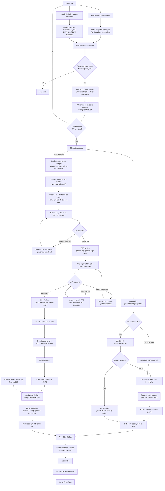

```mermaid
flowchart TD
    DEV["Developer"] --> PUSH["Push to feature/dev/name"]
    DEV --> LOCAL["Local: dbt build --target developer"]

    PUSH --> LINT["Lint + dbt parse + compile<br/>(no Snowflake credentials)"]
    LOCAL --> DEVSCHEMA["Isolated schema ANALYTICS_DEV<br/>(DEV_SANDBOX database)"]

    LINT --> PR["Pull Request to develop"]
    DEVSCHEMA --> PR

    PR --> GUARD{"Target schema starts<br/>with analytics_dev?"}
    GUARD -->|"No"| GFAIL["Fail hard"]
    GUARD -->|"Yes"| PRCI["dbt Slim CI build + tests<br/>(state:modified+, --defer dev state)"]
    PRCI --> PRCOMMENT["PR comment: selected models<br/>+ compiled SQL diff"]
    PRCOMMENT --> CHECKS{"Checks green<br/>+ PR approved?"}
    CHECKS -->|"No"| DEV
    CHECKS -->|"Yes"| MERGE["Merge to develop"]

    MERGE --> DEVRUN["dev deploy<br/>(concurrency group: dev)"]
    DEVRUN --> STATE{"dev state exists?"}
    STATE -->|"No (cold start)"| BOOT["Full dbt build (bootstrap)"]
    STATE -->|"Yes"| SLIM["dbt Slim CI (state:modified+)"]
    SLIM --> SEL{"Nodes selected?"}
    SEL -->|"Zero"| NOOP["Log NO-OP<br/>(no diff vs dev state @ SHA)"]
    SEL -->|"Some"| DEPLOY["Deploy to shared DEV Snowflake"]
    BOOT --> DEPLOY

    DEPLOY --> DROP["Drop removed models<br/>(this env schema only)"]
    DROP --> PUBSTATE["Publish dev state (only if green)"]
    PUBSTATE --> BUMP["Bot: bump deploy/dev to SHA"]
    NOOP --> BUMP

    BUMP --> ARGO["Argo CD / GitOps"]
    ARGO --> SYNC["Verify Healthy + Synced<br/>at target revision"]
    SYNC --> K8S["Kubernetes"]
    K8S --> AIRFLOW["Airflow (per environment)"]
    AIRFLOW --> SNOW["dbt on Snowflake"]

    MERGE -.->|"later, batched"| ACC["develop accumulates merges<br/>(dev only, no cascade to RCT / PPD)"]
    ACC --> CUT["Release Manager: cut-release<br/>(workflow_dispatch)"]
    CUT --> RELBR["release/vX.Y.Z at develop SHA<br/>+ draft GitHub Release (no tag)"]

    RELBR --> RCTCI["RCT deploy: Slim CI to RCT Snowflake"]
    RCTCI --> QA{"QA approval"}
    QA -->|"Feature rejected"| REVERT["git revert merge commit<br/>+ quarantine_model.sh"]
    REVERT --> RCTCI
    QA -->|"Approved"| RCTAF["RCT Airflow<br/>(bump deploy/rct + Argo sync)"]

    RCTAF --> PPDCI["PPD deploy: Slim CI to PPD Snowflake"]
    PPDCI --> UAT{"UAT approval"}
    UAT -->|"Not finished"| WAIT["Release waits in PPD<br/>(prod date slips, no override)"]
    WAIT --> UAT
    UAT -->|"Feature rejected"| REVERT2["Revert + quarantine<br/>(partial release)"]
    REVERT2 --> PPDCI
    UAT -->|"Approved"| PPDAF["PPD Airflow<br/>(bump deploy/ppd + Argo sync)"]

    PPDAF --> RELPR["PR release/vX.Y.Z to main"]
    RELPR --> UATREV["Required reviewers:<br/>UAT / business owners"]
    UATREV --> MAIN["Merge to main"]
    MAIN --> TAG["Create immutable tag vX.Y.Z"]

    TAG --> PRODRUN["production-deploy<br/>(single workflow run)"]
    ROLLBACK["Rollback: select earlier tag<br/>(e.g. v1.6.2)"] --> PRODRUN
    PRODRUN --> PRDSNOW["PRD Snowflake<br/>(Slim CI at tag, optional blue-green)"]
    PRDSNOW --> PRDBUMP["Bump deploy/prd to same tag"]
    PRDBUMP --> ARGO
```